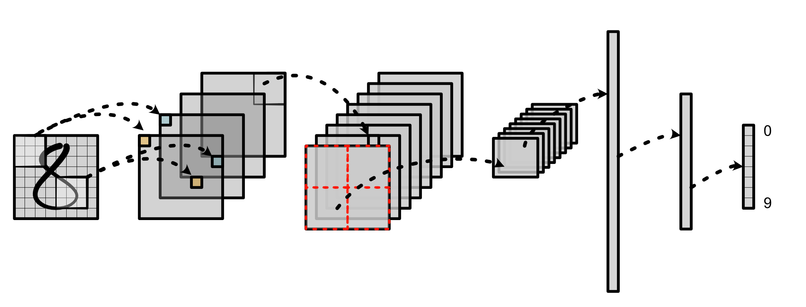

MiniTorch 是一个面向希望了解深度学习系统内部概念的机器学习工程师的 DIY 教学库。它是 Torch API 的纯 Python 重新实现，旨在简单、易读、经过测试且增量的。最终的库可以运行 Torch 代码。

<div style="text-align: center;">
    
</div>

该课程的主要仓库可在 [GitHub](https://github.com/minitorch/minitorch) 上找到。为了完成任务，你需要填写 TODO 声明并通过包含的单元测试套件。此外，还有额外的可视化工具来追踪你的进度。

```python
class ReLU(ScalarFunction):

    @staticmethod
    def forward(ctx, a):
        # TODO: Implement for Task 1.2.
        raise NotImplementedError('Need to implement for Task 1.2')

    @staticmethod
    def backward(ctx, d_output):
        # TODO: Implement for Task 1.4.
        raise NotImplementedError('Need to implement for Task 1.4')
```

最新的原始的文档在 [minitorch docs](https://minitorch.github.io/) 这里可以找到

另外还有一份 2021 年版本的文档在 [minitorch 2021 docs](https://minitorch.github.io/2021/index.html) 可以看到

这份文档在原始文档上对重要部分做了翻译和解读，对于必要但容易阅读的部分照搬了原始文档。

在阅读 TaskN 部分的时候，一般有 Assignment 和后面其他几个部分，请注意一般要穿插阅读，后面几个部分一般都是 Assignment 的一些基础知识

其他参考资料：

- [MiniTorch-学习全攻略](https://dezeming.top/wp-content/uploads/2022/02/MiniTorch-%E5%AD%A6%E4%B9%A0%E5%85%A8%E6%94%BB%E7%95%A5.pdf)
- [ysy 的 MiniTorch 实现](https://github.com/ysyisyourbrother/MiniTorch)
- [asmairfan04 的 Minitorch Module0 实现](https://github.com/minitorch/minitorch-module-0-asmairfan04)
- [thelonejordan 的 Minitorch Module1 实现](https://github.com/minitorch/minitorch-module-1-thelonejordan)

上面的参考资料有的版本较老，但是仍旧有着参考价值，本文档是 2024 年 3 月时仍能运行通过 pytest 的最新版本，且结合了网上各种资料的说明
