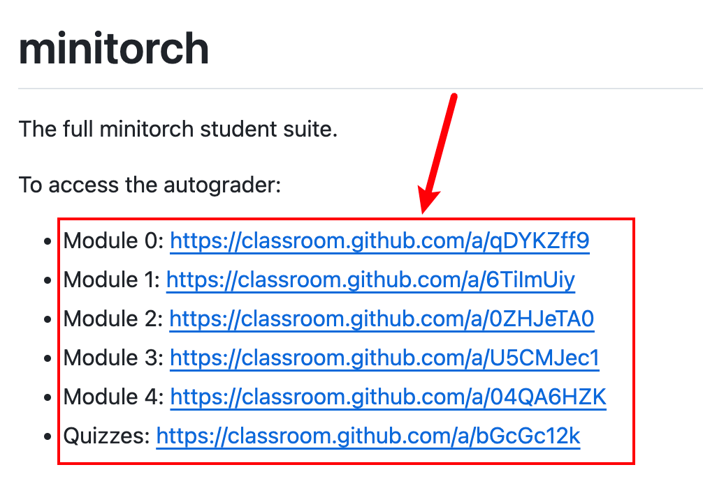

### 环境要求

创建一个虚拟环境，要求Python 3.8 ~ 3.11

### 创建单个 Module 个人仓库

点击下面的链接来创建单个的 Module 个人仓库

<div style="text-align: center;">
    
</div>

创建之后 git clone 到本地即可

### 安装依赖

```shell
python -m pip install -r requirements.txt
python -m pip install -r requirements.extra.txt
python -m pip install -Ue .
```

如果是使用的 conda，还需要：`conda install llvmlite`

### 测试

进入 python 环境然后运行：

```
import minitorch
```

测试是否成功