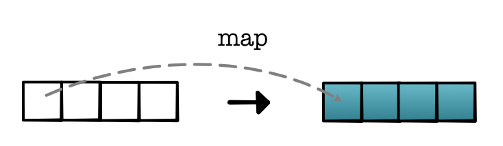
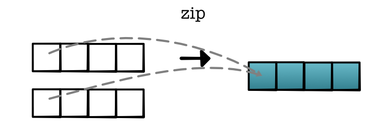
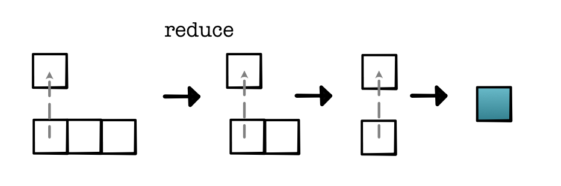
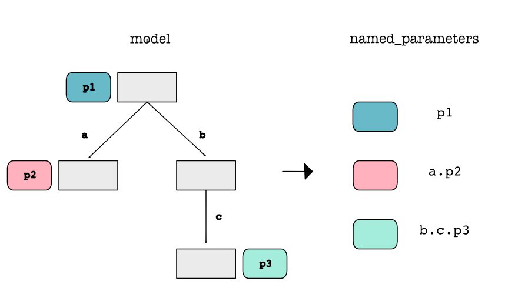

Task0 的部分就是照着原文档的这个部分做：[module0](https://minitorch.github.io/module0/module0/)

### Code Example

下面的内容具体可以参考 Task0（也即 Module0）的[实现代码](https://github.com/minitorch/minitorch-module-0-IcyFeather233)，已经通过 GitHub Classroom 的全部测试

### Task0.1 Operators

!!! info "todo"
    完成 `minitorch/operators.py` 中标记为 `task0_1` 的测试函数。

我们不要着急开始写，先把 [operator 基础知识](https://minitorch.github.io/module0/module0/#task-01-operators) 仔细阅读一遍，了解 `operators.py` 实现方面的数学基础

需要注意的有 `minitorch.operators.sigmoid(x: float) -> float` 这个函数，这个函数为了稳定性，在大于零和小于零的时候计算公式会发生变化

### Task0.2 Testing and Debugging

我们要求您为Task0.1中的运算符实现属性测试。这些测试应确保您的函数不仅能工作，而且还要遵循任何输入的高级数学属性。请注意，您需要更改这些测试函数的参数。

!!! info "todo"
    完成 `test/test_operators.py` 中标记为 `task0_2` 的测试函数。

### Task0.3 Functional Python

为了练习在Python中使用高阶函数，实现三个基本的函数式概念。将它们与Task 0.1中描述的运算符结合使用，以构建在列表上而非单个值上运作的更复杂的数学运算。

!!! info "todo"
    完成 `minitorch/operators.py` 中标记为 `task0_3` 的测试函数。


**minitorch.operators.map(fn: Callable[[float], float]) -> Callable[[Iterable[float]], Iterable[float]]**

<div style="text-align: center;">
    
</div>

参数：

- fn：一个从一个值映射到一个值的函数。

返回：

- 一个函数，该函数接受一个列表，将`fn`应用于每个元素，并返回一个新的列表。


**minitorch.operators.negList(ls: Iterable[float]) -> Iterable[float]**

使用 `map` 和 `neg` 来对 `ls` 中的每个元素进行取反


**minitorch.operators.zipWith(fn: Callable[[float, float], float]) -> Callable[[Iterable[float], Iterable[float]], Iterable[float]]**

<div style="text-align: center;">
    
</div>

参数：

- fn: 合并两个值
    
返回：

- 一个函数，它接受两个大小相等的列表 `ls1` 和 `ls2`，通过对每一对元素应用 fn(x, y)，生成一个新的列表。


**minitorch.operators.addLists(ls1: Iterable[float], ls2: Iterable[float]) -> Iterable[float]**

使用 `zipWith` 和 `add` 将 `ls1` 和 `ls2` 的元素相加。


**minitorch.operators.reduce(fn: Callable[[float, float], float], start: float) -> Callable[[Iterable[float]], float]**

<div style="text-align: center;">
    
</div>

参数：

- fn: 合并两个值
- start: 起始值 x_0

返回：

- 一个函数，它接受元素列表 x_1 ... x_n 并以这样的形式计算： `fn(x_3, fn(x_2, fn(x_1, x_0)))`，这种操作叫做 reduction。


**minitorch.operators.sum(ls: Iterable[float]) -> float**

使用 `reduce` 和 `add` 对列表进行求和。


**minitorch.operators.prod(ls: Iterable[float]) -> float**

使用 `reduce` 和 `mul` 计算列表的乘积。


### Task0.4 Modules

这个任务是要实现 :class:`minitorch.Module` 类的核心结构。我们要求你实现一个树形数据结构，每个节点上都存储有命名的 :class:`minitorch.Parameter`。这样的数据结构使用户能够方便地创建树，以便遍历找到所有感兴趣的参数。

<div style="text-align: center;">
    
</div>


!!! tip
    可以进入 `project` 目录运行 `streamlit run app.py -- 0` 中使用 `Module Sandbox` 部分来测试系统

!!! info "todo"
    完成 `minitorch/module.py` 中标记为 `task0_4` 的测试函数。

??? tip "类的魔法属性和魔法方法"
    1. `__dict__`：这是一个字典对象，用于存储一个对象的所有属性。这个字典的键是属性名，值是属性值。例如：
        ```python
            class MyClass:
                def __init__(self, name, age):
                    self.name = name
                    self.age = age

            obj = MyClass('Alice', 20)
            print(obj.__dict__)  # 输出: {'name': 'Alice', 'age': 20}
        ```
    2. `__setattr__`：当尝试设置一个属性的值时，这个方法会被调用。它接收两个参数：一个是属性名，另一个是属性值。例如：
        ```python
            class MyClass:
                def __setattr__(self, name, value):
                    print(f'Setting {name} to {value}')
                    self.__dict__[name] = value

            obj = MyClass()
            obj.x = 10  # 输出: Setting x to 10
        ```
    3. `__getattr__`：当尝试访问一个不存在的属性时，这个方法会被调用。它接收一个参数：属性名。例如：

        ```python
        class MyClass:
            def __getattr__(self, name):
                return f'{name} does not exist'

        obj = MyClass()
        print(obj.x)  # 输出: x does not exist
        ```

    4. `__call__`：当一个对象被“调用”（像函数那样）时，这个方法会被调用。例如：

        ```python
        class MyClass:
            def __call__(self, *args, **kwargs):
                print('Object is called with', args, kwargs)

        obj = MyClass()
        obj(1, 2, x=3, y=4)  # 输出: Object is called with (1, 2) {'x': 3, 'y': 4}
        ```

    5. `__repr__`：这个方法返回一个字符串，描述这个对象。当我们打印一个对象或者调用`repr()`函数时，这个方法会被调用。例如：

        ```python
        class MyClass:
            def __init__(self, name, age):
                self.name = name
                self.age = age

            def __repr__(self):
                return f'MyClass(name={self.name}, age={self.age})'

        obj = MyClass('Alice', 20)
        print(obj)  # 输出: MyClass(name=Alice, age=20)
        ```

    6. `__str__`：当我们使用`print()`函数或者`str()`函数时，`__str__`方法将被调用。如果一个类没有定义`__str__`方法，Python将使用`__repr__`作为备选。

        `__str__`方法应该返回一个字符串，这个字符串描述了这个对象。这个字符串通常是对用户友好的，而`__repr__`方法返回的字符串更适合开发者阅读，通常可以用来重建这个对象。

        下面是一个例子：

        ```python
        class MyClass:
            def __init__(self, name, age):
                self.name = name
                self.age = age

            def __repr__(self):
                return f'MyClass(name={self.name}, age={self.age})'

            def __str__(self):
                return f'{self.name}, {self.age} years old'

        obj = MyClass('Alice', 20)
        print(obj)  # 输出: Alice, 20 years old
        print(repr(obj))  # 输出: MyClass(name=Alice, age=20)
        ```

        在这个例子中，`print(obj)`调用了`__str__`方法，而`repr(obj)`调用了`__repr__`方法。我们可以看到，`__str__`方法返回的字符串更适合用户阅读，而`__repr__`方法返回的字符串提供了更多的信息，适合开发者阅读。


**minitorch.module.Module.train() -> None**

将此模块及其所有子模块的模式设置为 `train` 模式。

**minitorch.module.Module.eval() -> None**

将此模块及其所有子模块的模式设置为 `eval` 模式。

**minitorch.module.Module.named_parameters() -> Sequence[Tuple[str, Parameter]]**

收集此模块及其所有子模块的所有参数。

返回：

- `Sequence[Tuple[str, Parameter]]` - 每个祖先参数的名称和参数。

**minitorch.module.Module.parameters() -> Sequence[Parameter]**

遍历此模块及其所有子模块的所有参数。

??? note "`named_parameters()` 和 `parameters()` 的区别"
    `named_parameters()` 和 `parameters()` 是 PyTorch 中的两个函数，它们都用于获取模型中的参数，但是返回的内容有所不同。

    `parameters()` 是一个返回模型所有参数的迭代器。它会返回模型中所有的参数，不包括名称。这对于遍历模型的所有参数，如在优化器中更新参数时非常有用。

    例如：

    ```python
    for param in model.parameters():
        print(param)
    ```

    `named_parameters()` 也是一个返回模型所有参数的迭代器，但它返回的是一个元组，元组中包含每个参数的名称和参数本身。这对于需要知道参数名称的情况非常有用，例如在打印特定参数或者理解模型的结构时。

    例如：

    ```python
    for name, param in model.named_parameters():
        print(name, param)
    ```

    总的来说，`parameters()` 和 `named_parameters()` 的区别在于是否返回参数的名称。


### 本节代码解读

Task0 部分的主要编写内容是 `minitorch/operators.py` 和 `minitorch/modules.py`

#### `minitorch/operators.py`

这个`operators.py`文件是`minitorch`项目的一部分，它定义了一系列在代码库中使用的核心数学运算符。这些运算符被设计成函数，以便在神经网络的构建和训练过程中使用。文件的设计旨在提供基础的数学操作，同时保持代码的可读性和模块化。

##### 基本数学运算

文件首先定义了一些基本的数学运算函数，如乘法(`mul`)、加法(`add`)、减法(`neg`)、比较(`lt`, `eq`)、最大值(`max`)和指数运算(`sigmoid`, `relu`)。这些函数是构建更复杂数学模型的基础。例如，`sigmoid`函数和`relu`函数是神经网络中常用的激活函数，它们帮助确定神经元是否应该被激活。

##### 高阶函数

文件的后半部分定义了一些高阶函数，这些函数接受其他函数作为参数，并返回新的函数。例如，`map`函数接受一个函数`fn`并返回一个新的函数`mapper`，该新函数将`fn`应用于输入列表的每个元素。这在处理数据时非常有用，比如在神经网络中对权重或梯度进行操作。

`zipWith`函数是另一个高阶函数，它接受一个二元函数`fn`并返回一个新的函数`zipper`，该函数将`fn`应用于两个列表中对应位置的元素。这在并行处理数据时非常有用，比如在计算两个数据集之间的相关性时。

`reduce`函数是一个高阶函数，它接受一个二元函数`fn`和一个起始值`start`，并返回一个新的函数`reducer`。这个新函数将列表中的元素通过`fn`函数逐步组合起来，最终得到一个单一的累积结果。这是实现如求和(`sum`)和求积(`prod`)等操作的基础。

##### 设计理念

这样的设计有几个优点：

1. **模块化**：每个操作都是一个独立的函数，使得代码更加模块化，易于理解和维护。
2. **可重用性**：定义的函数可以在项目的不同部分重复使用，提高了代码的可重用性。
3. **可扩展性**：通过高阶函数，可以轻松创建新的函数来处理特定的操作，这使得代码库更加灵活和可扩展。
4. **易于测试**：独立的函数单元使得对代码进行测试和验证变得更加容易。

总的来说，`operators.py`文件的设计遵循了函数式编程的原则，通过提供一系列基础的数学操作和高阶函数，为构建复杂的神经网络模型提供了坚实的基础。

#### `minitorch/module.py`

`module.py`文件是`minitorch`项目中的一个关键组成部分，它定义了神经网络模型的基本构建块——模块（Module）。这个文件的设计目的是为了提供一个灵活且可扩展的方式来构建和组织神经网络的不同层和组件。

##### 模块（Module）类

`Module`类是神经网络中所有层和组件的基类。它具有以下几个关键特性：

1. **树形结构**：`Module`类使用字典来存储子模块（`_modules`），这允许创建复杂的层嵌套结构，形成树形的网络结构。这种结构反映了神经网络的真实构成，其中每一层都可以包含更多的层或参数。

2. **参数管理**：`Module`类还存储了模块的参数（`_parameters`），这些参数是网络中需要学习的数据。通过这种方式，可以轻松地管理和访问网络中的所有参数。

3. **训练与评估模式**：`Module`类提供了`train`和`eval`方法，用于切换模块及其所有子模块的训练模式和评估模式。这对于控制网络的行为非常重要，特别是在使用诸如dropout或批量归一化这样的技术时，这些技术在训练和评估时的行为是不同的。

4. **参数访问**：`Module`类提供了`named_parameters`和`parameters`方法，用于遍历网络中的所有参数及其名称。这有助于在训练过程中进行参数的迭代和更新。

5. **动态属性**：`Module`类重写了`__setattr__`和`__getattr__`方法，允许动态地添加和访问子模块和参数。这提供了极大的灵活性，可以轻松地向模块中添加新的层或参数。

6. **可调用对象**：`Module`类是可调用的，这意味着你可以直接调用一个模块实例来执行其前向传播（`forward`）方法。这与Python中函数式编程的概念相呼应，使得模块的使用更加直观。

7. **可读的表示**：`Module`类的`__repr__`方法提供了一个易于阅读的字符串表示，显示了模块的结构和包含的子模块。这对于调试和理解网络结构非常有用。

##### 参数（Parameter）类

`Parameter`类是`Module`类的一个内部类，用于特殊处理模块中的参数。它允许参数持有一个值（`value`），并且可以更新这个值。`Parameter`类还处理了参数的命名（`name`），这对于跟踪和调试参数非常有用。

##### 设计理念

`module.py`文件的设计遵循了以下几个原则：

1. **封装**：通过将参数和子模块封装在`Module`类中，代码变得更加清晰和模块化，易于管理和扩展。

2. **灵活性**：动态属性和可调用对象的设计使得`Module`类非常灵活，可以轻松地添加新的层或参数，以及执行前向传播。

3. **易用性**：通过提供`train`和`eval`方法，以及易于阅读的表示，`Module`类使得神经网络的构建和调试变得更加简单。

4. **可扩展性**：树形结构的设计允许创建复杂的网络结构，支持从简单的单层到复杂的深度学习模型。

总的来说，`module.py`文件为`minitorch`项目提供了一个坚实的基础，用于构建和组织神经网络模型。它的设计旨在提高代码的可读性、可维护性和可扩展性，同时保持了编程的灵活性和易用性。

### Task0.5 Visualization

对于前几个作业，我们使用了在 `minitorch/datasets.py` 中实现的一组数据集，这些是2D点分类数据集。（可以参考 [TensorFlow Playground](https://playground.tensorflow.org/) 查看类似的例子。）这些数据集都可以添加到可视化中。

要使用系统进行实验，请使用：

```
streamlit run app.py -- 0
```

阅读 `project/run_torch.py` 中的代码，你可以初步了解到一个使用 Torch 对这些数据集进行模型实现的例子。

??? note "`project/run_torch.py` 代码解读"
    这个代码文件中使用了 minitorch 的 datasets 作为数据集，由于我们的 minitorch 还没写完，所以训练部分用的仍然是 torch 库，但是使用的时候做到了模仿 minitorch 从底层开始实现，例如对于 `Linear` 函数并没有直接调用，而是通过 `torch.nn.Parameter` 来编写，相当于模仿 minitorch 来造轮子

    核心部分注释：

    ```python
    def train(
        self,
        data,  # 训练数据
        learning_rate,  # 学习率
        max_epochs=500,  # 最大训练轮次，默认为500
        log_fn=default_log_fn,  # 日志函数，默认为default_log_fn
    ):
        # 重新初始化神经网络模型
        self.model = Network(self.hidden_layers)
        self.max_epochs = max_epochs
        model = self.model

        # 用于存储每个epoch的损失值
        losses = []

        # 对每个epoch进行迭代
        for epoch in range(1, max_epochs + 1):
            # 前向传播
            # 首先将输入数据转为tensor并设置requires_grad=True以便能计算梯度
            out = model.forward(torch.tensor(data.X, requires_grad=True)).view(data.N)
            # 将目标值转为tensor
            y = torch.tensor(data.y)

            # 计算二元交叉熵损失
            probs = (out * y) + (out - 1.0) * (y - 1.0)
            loss = -probs.log().sum()

            # 反向传播
            # 计算损失函数关于模型参数的梯度
            loss.view(1).backward()

            # 更新参数
            for p in model.parameters():
                if p.grad is not None:
                    # 使用梯度下降法更新参数
                    p.data = p.data - learning_rate * (p.grad / float(data.N))
                    # 清零梯度，为下一轮计算做准备
                    p.grad.zero_()

            # 记录预测正确的数量和损失值
            pred = out > 0.5  # 预测结果，如果输出大于0.5，预测为1，否则预测为0
            correct = ((y == 1) * (pred)).sum() + ((y == 0) * (~pred)).sum()  # 计算预测正确的数量
            loss_num = loss.reshape(-1).item()  # 获取损失值
            losses.append(loss_num)  # 将损失值添加到损失列表中

            # 每10个epoch或者最后一个epoch打印日志
            if epoch % 10 == 0 or epoch == max_epochs:
                log_fn(epoch, loss_num, correct.item(), losses)
    ```

你也可以通过调整参数来提供一个试图执行分类任务的模型。

!!! info
    启动一个 streamlit server 并打印数据集的图像。手动创建分类器，将线性数据集按照正确的颜色进行划分。

    将图像和你使用的参数一起添加到你的代码库中的 README 文件里。